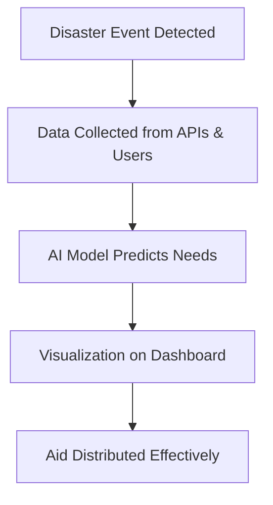

# 🌍 Aid Atlas AI

> **AI-powered Disaster Relief & Aid Coordination Platform**  
> Turning chaos into clarity: real-time insights, faster aid, and smarter disaster response.

---

## 🚀 Live Demo  
[

---

## 📖 About the Project  

### 🔥 Inspiration  
Every second counts in a disaster. We were inspired by the real-world challenge of **inefficient aid distribution** and **slow disaster response**. During earthquakes, floods, or wildfires, resources often arrive late or go to the wrong places. Our mission with **Aid Atlas AI** is simple:  
**Save lives by bringing AI-driven clarity, speed, and fairness to disaster relief.**

### 💡 What it does  
- 🛰️ **Real-time Disaster Mapping**: Visualizes disaster zones using AI & geospatial data.  
- 🤖 **AI-Powered Resource Prediction**: Predicts where food, shelter, and medical aid are needed most.  
- 📊 **Dashboard for NGOs & Governments**: Offers a clear overview of aid flow, shortages, and bottlenecks.  
- 📱 **Mobile-Friendly Interface**: Ensures accessibility for field workers on low-resource devices.  

### 🛠️ How we built it  
- **Frontend**: React + TailwindCSS for a sleek, Apple-style design.  
- **Backend**: Node.js + Express for handling APIs and workflows.  
- **Database**: MongoDB for scalable data storage.  
- **AI Models**: Trained with Python (TensorFlow + scikit-learn) to predict demand and classify severity zones.  
- **Maps**: Integrated with Leaflet.js & Mapbox for real-time geospatial visualizations.  

### 🧗 Challenges we ran into  
- Balancing **real-time data** with limited APIs.  
- Designing a UI that feels **intuitive under stress conditions**.  
- Integrating multiple tech stacks seamlessly.  
- Optimizing AI models for **fast, reliable predictions** without internet-heavy dependencies.  

### 🏆 Accomplishments that we're proud of  
- Built a **working MVP in record time**.  
- Designed a **UI inspired by Apple**: clean, minimal, intuitive.  
- Created a **predictive model** that prioritizes aid effectively.  
- Won praise for **accessibility-first approach** (offline-first, mobile-first design).  

### 📚 What we learned  
- The importance of **human-centered design** in critical applications.  
- How to align **AI outputs with real-world humanitarian workflows**.  
- Collaboration across **frontend, backend, and AI engineers** in a time-sensitive build.  

### 🔮 What's next for Aid Atlas AI  
- 🛰️ Adding **satellite data integration** for more accurate disaster mapping.  
- 🤝 Partnerships with NGOs and governments for **real-world deployments**.  
- 📡 Offline-first **progressive web app (PWA)** for rural connectivity.  
- 🌍 Multi-language support for global adoption.  

---

## 🖥️ Screenshots  

### 🏠 Home Page  


### 📊 Dashboard  


### 🗺️ Disaster Map  


---

## ⚡ Workflow  



---

## 🛠️ Installation & Running Locally  

### 🔧 Prerequisites  
- Node.js (>=16)  
- MongoDB (local or cloud)  
- Python 3.9+ (for AI models)  

### 📥 Setup  

```bash
# Clone the repository
git clone https://github.com/yourusername/aid-atlas-ai.git

# Navigate into the folder
cd aid-atlas-ai

# Install dependencies
npm install

# Run backend
npm run server

# Run frontend
npm start
```

Project will run at: **http://localhost:3000** 🎉  

---

## 🤝 Contributing  

We welcome contributions! 🚀  
1. Fork the repo  
2. Create your branch (`git checkout -b feature-xyz`)  
3. Commit changes (`git commit -m "Added new feature"`)  
4. Push (`git push origin feature-xyz`)  
5. Open a Pull Request  

---

## 🏅 Acknowledgements  

- 🌍 Hackathon organizers for the challenge  
- 🤖 OpenAI & HuggingFace for AI models  
- 🗺️ Mapbox & Leaflet for map integrations  

---

## 📜 License  
[MIT License](LICENSE)

---

> Designed by **Team Aid Atlas AI**  
